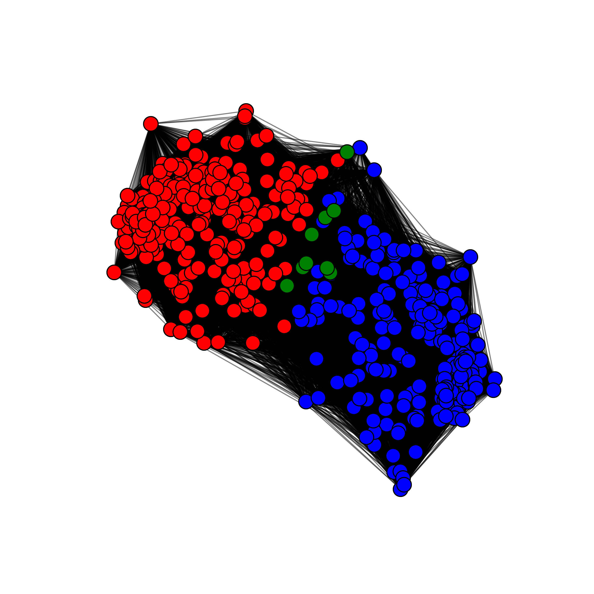
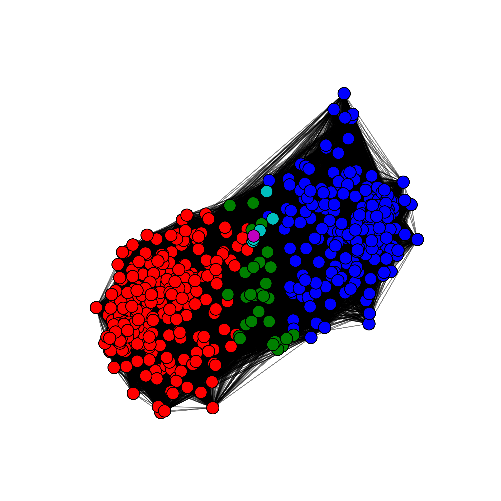

# Disciplina: Ciência das Redes
## Aluno: Pedro Natanael
### Análise de Detecção de Comunidades

#### 1) Algoritmos Selecionados
Para esta análise, foram escolhidos dois algoritmos de detecção de comunidades:
- **Leiden**: Um algoritmo popular conhecido por sua eficiência e precisão na otimização da modularidade.
- **Infomap**: Um algoritmo baseado no fluxo de informação, ideal para detectar estruturas sobrepostas ou hierárquicas em redes.

#### 2) Critério Objetivo para Determinar o Número Ótimo de Comunidades
Para avaliar a qualidade das comunidades detectadas, utilizou-se o **score de modularidade** como critério objetivo. A modularidade mede a força da divisão de uma rede em módulos (comunidades), comparando a densidade de conexões internas às comunidades com as conexões externas. Quanto maior a modularidade, melhor a definição das comunidades.
- **Leiden** alcançou uma modularidade de **0.4434**, sendo o melhor valor observado nesta análise.
- **Infomap** alcançou uma modularidade de **0.4425**, ligeiramente inferior, mas ainda indicando comunidades bem definidas.

#### 3) Otimização de Hiperparâmetros
Para cada algoritmo, os hiperparâmetros foram ajustados para identificar configurações que maximizam a modularidade:
- **Leiden**:
  - O parâmetro de resolução foi ajustado com valores variando de 0.5 a 2.0.
  - O melhor resultado foi obtido com uma resolução de **0.5**, resultando em uma modularidade de **0.4434**.
- **Infomap**:
  - A implementação da CDLib do Infomap não expõe hiperparâmetros ajustáveis diretamente. Para simular ajustes, os pesos das arestas foram escalados, mas não houve melhoria em relação à configuração padrão.

#### 4) Descrição das Comunidades
- **Leiden**:
  - **Número de Comunidades**: 3.
  - **Tamanhos das Comunidades**: As comunidades detectadas possuem os seguintes tamanhos: **283, 244 e 9 nós**.
  - **Interpretação**: O algoritmo Leiden tende a agregar nós em comunidades maiores, refletindo conectividade densa dentro desses grupos. A presença de uma comunidade muito pequena (9 nós) pode representar um grupo com conexões únicas.
  - **Visualização**:
    - 

- **Infomap**:
  - **Número de Comunidades**: 5.
  - **Tamanhos das Comunidades**: As comunidades detectadas possuem os seguintes tamanhos: **277, 224, 29, 5 e 1 nós**.
  - **Interpretação**: O algoritmo Infomap detectou mais comunidades, porém menores, em comparação ao Leiden. Isso reflete a sensibilidade do algoritmo aos padrões localizados de fluxo de informação. Notavelmente, uma comunidade contém apenas um nó, indicando um elemento isolado.
  - **Visualização**:
    - 

#### Resumo dos Resultados
Os resultados indicam que o **Leiden** proporciona uma divisão mais agregada da rede, enquanto o **Infomap** oferece uma granularidade maior, com comunidades mais fragmentadas. Os scores de modularidade de ambos os algoritmos são comparáveis, indicando que cada um fornece divisões significativas da estrutura da rede.